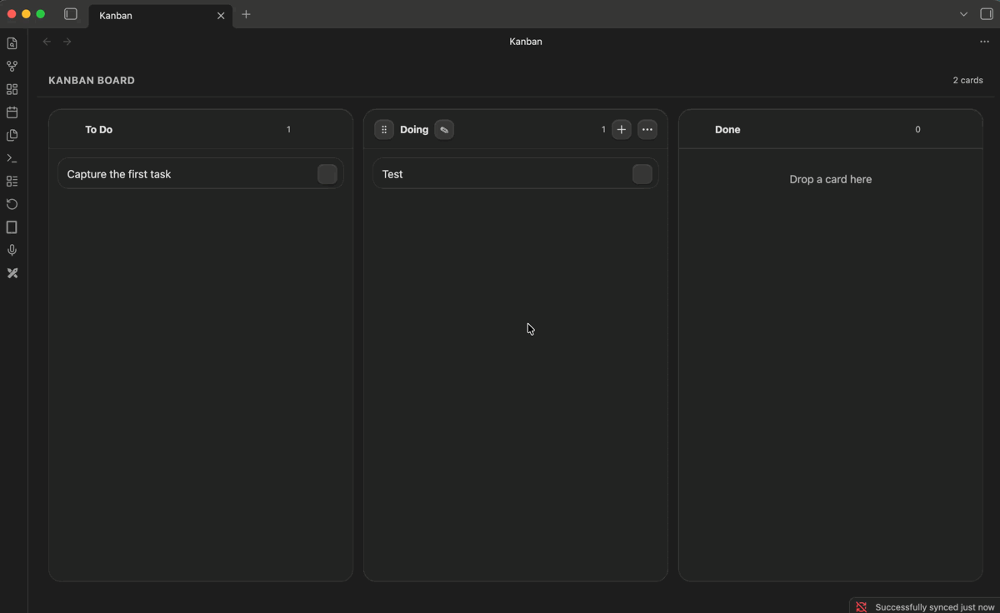

# React Kanban for Obsidian

<p align="center">
  
</p>

## Keep your Markdown boards. Upgrade the interface.

React Kanban is a modern, local-first Kanban board for Obsidian. Open your existing Markdown-backed boards in a fast React interface without migrating or changing their structure.

It uses the familiar `kanban-plugin: board` frontmatter marker, so your boards remain portable, editable, and readable as ordinary Markdown notes.



### Why React Kanban?

- Use existing Obsidian Kanban notes without migration
- Keep the underlying Markdown portable and transparent
- Work locally with no analytics, telemetry, or plugin network requests
- Turn linked notes and Markdown content into a visual board workflow

## Features

- Auto-opens kanban notes in a dedicated board view
- Drag cards within and between columns
- Reorder columns from the column menu
- Rename columns inline
- Add cards with a dialog
- Render markdown inside cards
- Mark cards complete and keep completed cards grouped at the bottom of each column
- Delete cards from the right-click menu

### New card note settings

When adding a card, you can optionally create a linked Markdown note. Configure its destination and filename in **Settings → Community plugins → React Kanban**:

- Keep notes in the board’s folder (the default)
- Create a subfolder named after the board
- Choose a custom vault-relative folder
- Name notes with the board and card title, or with the card title only

## Markdown Format

The plugin understands standard heading-based kanban notes:

```md
---
kanban-plugin: board
---

## To Do
- First task
- Second task

## Doing
- Work in progress

## Done
- Shipped item
```

## Installation

Install **React Kanban** from Obsidian’s Community plugins browser, then enable it in **Settings → Community plugins**.

Open a note with the `kanban-plugin: board` frontmatter marker and React Kanban will display it as a board. Your note stays a normal Markdown file, so you can continue editing it in source mode or with other compatible tools.

### Existing Kanban boards

React Kanban is designed to work with the standard heading-based Kanban format. No export or conversion step is required. Make a backup of important notes before trying any new plugin, as you would with any tool that writes to your vault.

For local development, copy the built files into your vault plugin folder:

```bash
npm install
npm run build
```

## Development

- `npm run typecheck`
- `npm run build`

## Privacy

This plugin does not send analytics, telemetry, or network requests of its own. It reads and writes the current note through Obsidian’s local vault APIs only.

## License

MIT
